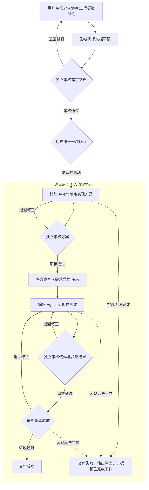

# OneManArmy

一个人完成初始需求确认，随后由一支 Codex Agent 团队无人值守地完成软件交付。

> 当前状态：总体目标已经重新确认。项目已具备本地 Web UI、需求讨论、需求文档草稿、历史对话持久化和 Agent 配置等基础能力；计划、编码、审核、自动纠偏和最终交付组成的无人值守闭环尚未实现。

## 运行当前版本

需要 Node.js 18 或更高版本，并已在本机登录 Codex。

```powershell
npm install
npm run build
npm start
```

然后访问 `http://127.0.0.1:8765`。当前版本由仅监听本机的 Node.js 服务托管页面并调用 Codex，不需要远程后端。

运行自动测试：

```powershell
npm test
```

## 项目目标

OneManArmy 用于把软件需求从人工逐阶段推动的 Code Agent 工作方式，转变为只需一次初始确认的无人值守交付流程。

用户只在初始需求讨论阶段参与。需求 Agent 必须在这一阶段完成目标、范围、非目标、业务口径、验收标准、执行授权和必要决策规则的确认，并形成需求文档。需求文档通过独立审核并由用户确认后，后续计划、编码、测试、审核、修正和交付全部由 Agent 自主完成。

需求文档确认是整个交付流程中唯一必需的人工确认点。确认后，系统不得暂停并要求用户补充决定，不得把 Code Agent 原本需要人工确认的步骤继续转交给用户。

本项目基于 Codex，不建设通用模型平台、第三方模型供应商抽象或动态模型路由能力。固定 Agent 的项目级配置属于执行配置，不得在交付过程中产生新的人工确认点。

## 第一阶段范围

- 面向软件需求开发，不处理研究、写作和日程管理等通用任务。
- 优先支持已有代码项目，以 AlphaPredator 一类具有现有代码、文档和项目约束的项目作为验证场景。
- 从零创建软件项目是后续改进方向，第一阶段不实现项目初始化能力。
- 保留现有 Web UI 作为需求讨论、执行观察和结果查看入口；不符合无人值守目标的区域和交互可以替换或移除。
- 现有代码只作为已经验证过的原型和能力参考，不构成后续架构、技术选型或兼容性约束；必要时可以重写或替换。
- “保留 UI”是保留有价值的产品形态和交互设计，不要求保留当前前端或服务端实现。

## 核心原则

### 唯一人工阶段

- 用户只在需求讨论阶段参与必需的确认。
- 需求 Agent 必须主动识别后续可能阻塞交付的问题，并在需求文档确认前完成澄清。
- 初始讨论必须明确 Agent 的执行边界和完成任务所需的授权。
- 未解决的产品选择、业务歧义或必要授权存在时，不允许确认需求文档和启动交付。
- 用户可以主动观察、终止任务，但系统不得依赖用户继续推进流程。

### 确认后的自治执行

- 需求文档确认后，系统自动进入计划阶段，不再设置人工确认点。
- 原本需要人工确认的实现选择，由 Agent 根据项目约束、需求文档和已确认的决策规则自主处理。
- 每个关键阶段由独立审核 Agent 审核；审核不通过时自动退回对应 Agent 修正并重新审核。
- 实现方案不可行时，Agent 必须在已确认边界内重新规划，不得要求用户选择方案。
- 自动修正仍无法满足验收标准，或客观条件使需求无法完成时，流程以“交付失败”结束，并提供完整原因、证据和已完成工作，不得转为“等待用户确认”。

## 工作流程

每个需求依次经过三个阶段。只有第一阶段允许出现必需的用户交互。



### 1. 需求讨论

- 需求 Agent 与用户进行多轮讨论，明确目标、范围、非目标、业务口径、验收标准、执行授权和决策规则。
- 需求 Agent 根据讨论持续维护需求文档草稿。
- 独立审核 Agent 检查需求文档是否完整、一致、可执行，是否包含未经用户确认的推断，以及是否仍存在可能中断后续交付的待决策项。
- 审核退回时，由需求 Agent 继续与用户讨论并修订需求文档。
- 需求文档通过审核后，由用户进行整个流程中唯一一次必需确认。
- 用户确认即表示执行契约成立，系统随即开始无人值守交付。

### 2. 计划

- 计划 Agent 根据项目约束和已确认的需求文档形成实现方案。
- 实现方案说明总体思路、影响范围、必要变更、任务拆分、验证方式和已知风险。
- 独立审核 Agent 检查方案是否符合项目约束和需求文档。
- 审核不通过时，计划 Agent 根据意见自动修正并重新提交审核。
- 审核通过的方案写入同一份需求文档的 `How` 章节，然后自动进入编码阶段。
- 如果某个方案会改变已确认的需求目标、范围、行为或验收标准，该方案必须被否决；计划 Agent 应在原执行契约内寻找其他方案。

### 3. 编码与交付

- 编码 Agent 按需求文档实现功能，并完成必要的测试、构建、文档同步和修正。
- 独立审核 Agent 检查代码差异、验证结果以及实现与需求文档的一致性。
- 审核或验证不通过时，成果自动退回编码 Agent 修正，并重复验证和审核。
- 审核通过后，系统执行最终整体验收并交付结果。
- 如果需求在已确认的执行契约内客观上无法完成，系统结束本次交付并生成失败报告，不得在执行中返回需求讨论或请求用户确认。

## 审核与自动纠偏

- 需求文档、实现方案、代码实现和最终交付必须接受独立审核。
- 需求讨论阶段的审核结果可以是通过、退回修订或存在待用户决策。
- 需求文档确认后的审核结果只能是通过或退回自动修正。
- 审核 Agent 不直接代替生产 Agent 修改成果，必须给出具体、可验证的审核意见。
- 生产 Agent 根据审核意见自动修正并重新提交审核。
- 审核 Agent 不得降低验收标准来使结果通过。
- 自动纠偏无法得到合格结果时，以交付失败结束，不请求用户介入当前执行流程。

## 事实来源和优先级

整个流程遵循以下优先级：

1. 项目级约束。
2. 用户确认的需求文档中关于目标、范围、行为、授权和验收标准的内容。
3. 需求文档 `How` 章节中的当前审核通过方案。
4. 代码、测试及其他实现产物。

需求文档是单个需求的执行契约和唯一需求标准。项目级约束具有更高优先级，但只能约束需求和实现边界，不能被 Agent 用来擅自增加业务需求。

如果需求文档在确认前与项目约束冲突，必须在需求讨论阶段解决。如果确认后才发现冲突，Agent 应优先在已确认边界内重新规划；确实无法满足时，本次交付失败并输出证据，不得静默改变需求或请求用户在执行中重新确认。

## 需求文档维护原则

- 需求文档模板复用 AlphaPredator 项目的 Feature 文档结构。
- 需求文档中的需求内容定义要实现什么，并记录执行授权、决策规则和验收标准。
- 需求文档的需求内容经用户确认后，在本次交付过程中保持锁定。
- `How` 章节保存计划阶段最新审核通过的实现方案，可以由计划 Agent 和审核 Agent 在不改变已确认需求的前提下自动维护。
- 不单独维护一份与需求文档重复的实现计划。
- 需求文档只保留当前最新且有效的内容。
- 讨论草稿、被驳回的计划、旧方案和过期描述不进入正式需求文档，也不另行归档。
- Git 可以自然保留文件历史，但 OneManArmy 不为旧方案建设额外的历史管理能力。

## 建设 Milestone

以下 Milestone 是 OneManArmy 自身的建设顺序，不是单个软件需求运行时的三个交付阶段。后续开发原则上按顺序推进；每个 Milestone 达到完成标准后，再进入下一个 Milestone。

### M1 核心领域模型与架构基线

目标：脱离现有页面、接口和存储结构，定义无人值守交付系统本身。

- 定义需求、需求文档、交付任务、阶段、审核、执行尝试、交付产物和终态。
- 定义完整状态机、允许的状态转换以及成功、失败、取消条件。
- 定义工作流引擎、Agent 执行层、持久化层和 UI 之间的边界。
- 定义需求文档确认后的不可变执行契约，以及 Agent 可以自主决定的范围。

完成标准：形成经过确认的需求文档和架构基线；状态机中不存在需求文档确认后转入“等待用户决策”的路径。

### M2 持久化无人值守工作流内核

目标：先用可控的模拟 Agent 验证系统能够可靠地组织完整流程。

- 实现确定性的状态流转、任务持久化、执行记录和产物交接。
- 实现审核退回、自动重新执行、成功、失败和用户主动取消。
- 实现基础的幂等保护和服务重启后恢复。
- 使用模拟 Agent 覆盖正常流程、退回流程、异常流程和非法状态转换。

完成标准：不依赖 UI 和真实 Codex 调用，也能自动运行并恢复完整状态机；所有状态转换均有可验证记录。

### M3 统一 Codex Agent 执行层

目标：为需求、计划、编码和审核角色提供一致、可追踪的执行边界。

- 统一 Agent 的启动、续接、上下文输入、结构化输出、权限和执行结果记录。
- 工作流引擎决定调用时机和状态转换，Agent 不直接控制流程。
- 每次调用只获得当前阶段必需的上下文，避免把全部历史无差别注入 Agent。
- 固化单次交付使用的 Agent 配置，执行过程中不静默切换模型或权限。

完成标准：四类 Agent 可以通过统一接口独立执行，输入、输出、权限和失败结果均可持久化并由工作流引擎处理。

### M4 最小真实无人值守交付闭环

目标：尽快证明一个真实小型需求可以在唯一一次确认后完成交付。

- 接入需求文档独立审核、唯一确认和锁定。
- 接入计划 Agent、方案审核以及 `How` 自动写入。
- 接入编码 Agent、测试、代码审核和最终整体验收。
- 先通过 API、测试入口或最小界面打通流程，不要求复用现有 UI 实现。

完成标准：在受控的真实代码仓库中，至少一个需求从需求文档确认开始，无需任何后续人工确认，最终到达交付成功或带完整证据的交付失败。

### M5 自动纠偏与可靠性完善

目标：让无人值守流程能够处理真实执行中的失败，而不是只覆盖理想路径。

- 完善方案审核退回、代码审核退回、测试失败和最终验收退回的自动修正循环。
- 处理 Agent 异常、进程退出、超时、重复执行和无法满足验收标准等情况。
- 明确自动重试、重新规划和终止失败的边界，避免无限循环。
- 失败时生成包含原因、证据、执行历史和已完成工作的交付报告。

完成标准：故障注入和非理想场景验证通过；任何无法继续的流程都进入明确终态，不会停留在等待用户确认或无法解释的中间状态。

### M6 UI 接入与过程观察

目标：将现有 UI 中有价值的产品形态连接到真实工作流，必要时重写实现。

- 保留需求讨论、需求文档、阶段展示和工作台等有价值的产品结构。
- 展示真实的阶段状态、Agent 执行记录、审核意见、自动返工、验证结果和交付结果。
- 提供需求文档唯一确认入口和用户主动终止入口。
- 删除占位、重复或不符合无人值守目标的区域和交互。

完成标准：UI 不再展示伪状态或尚未接入的占位流程；用户可以完成初始讨论与唯一确认，并观察任务直至终态。

### M7 旧实现清理与交付加固

目标：在新闭环稳定后移除原型负担，形成可持续演进的正式实现。

- 判断旧服务、旧接口、旧存储和旧前端代码的保留或移除范围。
- 不为兼容旧原型而扭曲新架构；旧本地数据是否迁移作为独立决定处理。
- 删除被新实现替代的代码、占位内容和重复路径。
- 完成真实端到端回归、文档同步和最终架构一致性检查。

完成标准：正式运行路径唯一、边界清晰，旧原型不再参与核心交付流程，完整无人值守验收通过。

## 后续方向

- 支持从零定义和初始化新的软件项目。
- 在不增加执行中人工确认点的前提下，完善并行执行、失败恢复和交付效率。
