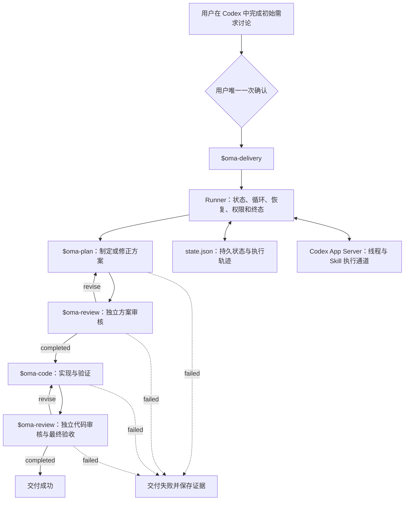

# OneManArmy

OneManArmy 是直接运行在 Codex 中的自动软件交付 Skill 套件。

用户在 Codex 中完成初始需求讨论与唯一一次确认，然后调用 `$oma-delivery`。此后由 Skill 内置 Runner 自动组织规划、独立审核、编码、返工和终态交付，不再要求用户进行中间确认。

## 当前状态

Skill + Runner 架构已经完成真实可行性验证：

- Codex App Server 能发现仓库级 Skills，并通过原生 `skill` 输入调用指定 Skill。
- Runner 能持久化状态、在独立线程中执行阶段 Skill，并根据结构化结果推进或返工。
- 真实验证经历了“规划 → 审核退回 → 重新规划 → 审核通过 → 编码 → 代码审核通过”。
- 六次真实调用使用六个独立线程，全程没有人工确认请求。
- 规划和审核阶段只读，只有编码阶段允许修改目标工作区。
- Runner 的正常完成、自动返工、中断恢复和失败终止测试均已通过。

当前实现是经过验证的架构基线，还不是完整生产版本。超时、进程异常、取消、重试分类、权限契约和真实大型仓库交付仍需继续完善。

## 使用方式

需要 Node.js 18 或更高版本，并已在本机登录 Codex。

```powershell
npm install
npm test
```

在 Codex 中打开本仓库后，仓库级 Skills 位于 `.agents/skills/`，可以直接调用：

```text
$oma-delivery
```

调用前必须先在初始讨论中确认完整需求，包括目标、范围、非目标、验收标准、执行授权和必要决策规则。Runner 启动后不再把实现决策转交给用户。

## 正式架构



### Skill 与 Runner 的边界

- `$oma-delivery` 是用户在 Codex 中调用的唯一正式入口。
- `$oma-plan`、`$oma-code` 和 `$oma-review` 负责需要模型判断的专业工作。
- Runner 不代替 Agent 思考，只负责确定性状态转换、返工循环、重试上限、独立线程、权限隔离、持久化和终态。
- Codex App Server 是 Runner 调用阶段 Skill 的执行通道。
- `state.json` 是恢复与审计依据；流程不能依赖模型记住上一次执行位置。
- 不提供绕过 Runner 的任意 Prompt 执行接口。

### 权限与终态

- 规划和审核线程使用只读权限。
- 只有编码线程可以修改目标工作区。
- Runner 以不请求人工批准的方式启动阶段线程。
- 超出已确认权限、超过返工上限或客观无法完成时，流程必须进入失败终态并保存证据。
- 正式终态只有成功、失败和取消，不存在“等待用户决定后继续”。

## 目录

```text
.agents/skills/
├── oma-delivery/
│   ├── SKILL.md
│   ├── agents/openai.yaml
│   └── scripts/
│       ├── runner.mjs
│       └── runner.test.mjs
├── oma-plan/
│   └── SKILL.md
├── oma-code/
│   └── SKILL.md
└── oma-review/
    └── SKILL.md
```

## 核心规则

- 用户只参与初始需求讨论和需求确认。
- 确认后的需求是不可变执行契约。
- 实现方案不得扩展或改变已确认的需求。
- 生产 Skill 与审核 Skill 使用独立线程。
- 审核结果只能推动通过、自动返工或失败终止。
- 自动修正不能通过降低验收标准获得通过。
- 无法完成时输出原因、证据和已完成工作，不返回人工确认流程。

## 当前差距与建设顺序

1. 完善 Runner：补齐取消、超时、进程异常、幂等、分类重试和权限契约。
2. 完善阶段 Skills：固定输入输出、上下文边界、最终验收和失败证据。
3. 验证真实交付：在受控真实仓库中无人值守完成需求、实现、测试、返工与交付。
4. 完善分发：整理为可安装、升级和移除的 Codex 插件或 Skill 包。
