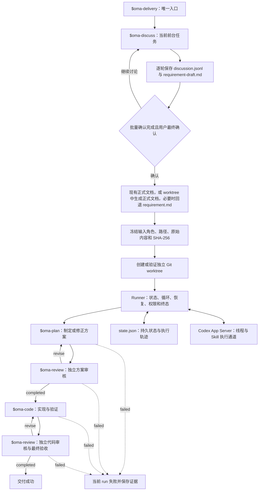

# OneManArmy

OneManArmy 是直接运行在 Codex 中、面向现有 Git 项目的软件需求交付 Skill 套件。

用户从初始想法开始调用 `$oma-delivery`。它把当前前台任务交给 `$oma-discuss`，持续保存讨论、需求草稿和待决定事项；用户最终确认冻结需求后，Runner 组织规划、独立审核、编码、返工和终态交付。

## 当前状态

当前实现包括：

- `$oma-discuss` 持久化多轮讨论与确认项；冻结需求前要求验证候选技术路径，并把可行性结论写入正式输入。
- Runner 冻结需求输入与哈希，为每个 run 绑定独立 Git worktree，并持久化阶段状态。
- `$oma-plan` 沿已确认路径制定方案并检查整份方案；`$oma-review` 只依据冻结需求、可行性约束和项目强制规则提出阻塞意见。Runner 把上一轮阻塞反馈传给后续 Reviewer。
- 规划和审核阶段只读，编码阶段可修改 run 的执行工作区；审核退回后在相应阶段自动返工。
- 每个自主阶段默认最长 30 分钟；超时会中断该阶段并记录可显式恢复的失败。

自动化测试覆盖正常完成、审核退回、状态恢复、worktree 隔离和失败终止。`npm run test:live` 只验证一次真实 App Server 只读规划调用；当前版本尚未在真实项目中重新完成全流程验收。整个 run 的总时间限制、主动取消和更完整的进程异常处理仍待完善。

## 安装与验证

需要 Node.js 18 或更高版本、Git，并已在本机登录 Codex。目标项目需有至少一个 Git 提交，且在仓库根目录忽略 `.oma/`，供 run 状态和独立 worktree 使用。

克隆仓库后，先安装依赖并运行测试：

```powershell
npm install
npm test
```

需要验证真实 Codex App Server 调用链时，再运行只读的临时仓库冒烟测试：

```powershell
npm run test:live
```

在本仓库中启动 Codex 时，Codex 会直接发现 `.agents/skills/` 下的仓库级 Skills，不需要额外安装。

首次在其他 Git 项目中使用时，请在 Codex 中调用 `$skill-installer`，从本仓库一次安装以下五个 Skill：

```text
$skill-installer 请从 https://github.com/primabrucexu/OneManArmy 安装 .agents/skills 下的 oma-delivery、oma-discuss、oma-plan、oma-code 和 oma-review
```

五个 Skill 必须一起安装；只安装 `$oma-delivery` 会缺少讨论、规划、编码或审核阶段。已安装的目录不会因仓库更新而自动升级，安装器也不会覆盖现有同名目录；升级时应仅备份并替换这五个 Skill，按目标提交逐文件校验。

Codex 通常会自动发现新安装的 Skill；如果技能列表没有刷新，重启 Codex。安装与发现机制参见 [OpenAI Skills 文档](https://learn.chatgpt.com/docs/build-skills)。

## 日常使用

在 Codex 中打开要开发的目标项目，从第一句需求想法开始调用：

```text
$oma-delivery 我想讨论并实现一个需求……
```

之后像普通对话一样逐步补充目标、范围、非目标、验收标准和约束，不需要一次写完，也不需要手动调用 `$oma-discuss`：

```text
先解决批量导入，导出这次不做。
重复数据怎么处理还没决定，我们继续讨论这个。
```

每个 OMA 都与一个原生 Codex 任务和一个 run 双向唯一绑定。后续消息默认续接当前任务绑定的 run；未绑定任务只有在用户给出精确 run ID 或唯一标题时才接管旧 run。显式“新建 OMA”会创建并切换到新的原生 Codex 任务，原任务继续绑定旧 run，不会因为工作区里只有一个活动需求就自动猜测。

首次理解目标并检查项目后，讨论阶段会一次性列出当前能识别的全部实质确认项。每项都有稳定编号、类别、当前理解、推荐选项、其他选项和影响；依赖或冲突关系会被持久化并在回答时校验。可以逐项回答，也可以回复“全部按推荐”。讨论阶段还需核实关键平台能力、权限和候选技术路径，记录已排除路径的依据。确认需求前，可以随时修改或排除之前提出的内容。准备进入自动交付时，明确最终确认当前需求：

```text
确认，按当前需求执行。
```

冻结输入必须包含已验证的实施路径、排除路径及依据、平台与权限约束。如果用户指定的现有正式需求文件已包含这些结论，OMA 直接冻结并使用它，不复制为 run 内的 `requirement.md`；原文有缺口时，另存 run 内 `requirement-supplement.md` 并共同冻结。如果需求由讨论形成，OMA 会读取项目指令、模板、索引、命名规则和既有文档的内容与哈希后生成正式需求文档提案；确认前展示目标路径、完整内容和必要索引修改，确认后先建立 run worktree，再只在该 worktree 中写入正式文档。没有可识别规范或没有正式文档写入授权时，才回退到 run 内通用 `requirement.md`。

确认后，Runner 冻结每个需求输入的角色、绝对路径、原始内容和 SHA-256，并创建或验证独立 Git worktree。规划、编码、审核和测试全部在 `executionWorkspace` 中运行；非 Git 工作区、worktree 冲突或输入漂移都会安全终止，不会退回共享目录。Runner 按“Plan → Review → Code → Review”推进；方案必须逐条覆盖验收标准，Reviewer 的阻塞项必须指出冻结依据、缺陷和所需结果。若冻结需求或可行路径必须改变，当前 run 失败终止，由新的原生 Codex 任务重新进入 Discuss。

讨论和执行状态保存在目标项目的 `.oma/runs/<requirement-id>/`，不依赖聊天窗口保留全部上下文：

- `discussion-state.json`：讨论状态、task/run 绑定、批量确认项和需求输入。
- `discussion.jsonl`：逐轮保存的完整讨论历史。
- `requirement-draft.md`：随讨论更新的当前需求草稿。
- `requirement-proposal.json`：确认前展示的项目正式需求文档及索引修改提案。
- `requirement.md`：仅在无项目规范或无正式文档写入授权时使用的通用回退文件。
- `requirement-supplement.md`：现有正式需求有缺口时保存的确认补充内容。
- `worktree.json`：源仓库、执行 worktree、分支和基准提交绑定。
- `state.json`：冻结输入、自动交付阶段、上一轮审核反馈、返工轨迹和最终状态。

## 当前流程



### Skill 与 Runner 的边界

- `$oma-delivery` 是用户在 Codex 中调用的唯一正式入口。
- `$oma-delivery` 只判断当前阶段并把工作路由给对应 Skill，不讨论需求、制定方案、编码或审核。
- `$oma-discuss` 在当前用户任务中负责交互式需求讨论、逐轮持久化和确认冻结；它不能在后台子线程中等待用户。
- `$oma-plan`、`$oma-code` 和 `$oma-review` 负责确认后的专业工作。
- Runner 不代替 Agent 思考，只负责确认后的确定性状态转换、返工循环、重试上限、独立线程、权限隔离、持久化和终态。
- Codex App Server 是 Runner 调用阶段 Skill 的执行通道。
- `discussion-state.json`、`discussion.jsonl`、需求文档、`worktree.json` 和 `state.json` 是恢复与审计依据；流程不能依赖模型记住上一次执行位置。
- 不提供绕过 Runner 的任意 Prompt 执行接口。

### 权限与终态

- 讨论阶段在最终确认前只允许写入当前 run 目录；正式需求文档仅在确认后写入 run 的独立 worktree。
- 规划和审核线程使用只读权限，并且只看到 `executionWorkspace`。
- 在 Runner 的自主阶段中，只有编码线程可以修改 `executionWorkspace`；确认后的正式需求文档由 Discuss 写入 run worktree。
- Runner 不自动提交、合并、推送、删除或 prune 分支和 worktree。
- Runner 以不请求人工批准的方式启动阶段线程。
- 超出已确认权限、超过返工上限或客观无法完成时，流程进入失败终态并保存证据；需要修改冻结需求或可行路径时，在新任务中重新讨论。
- 讨论阶段允许等待用户继续输入；当前 Runner 的自动流程以成功或失败结束。状态模型保留取消终态，但尚无主动取消入口。

## 目录

```text
.agents/skills/
├── oma-discuss/
│   ├── SKILL.md
│   ├── agents/openai.yaml
│   └── scripts/
│       ├── discuss.mjs
│       └── discuss.test.mjs
├── oma-delivery/
│   ├── SKILL.md
│   ├── agents/openai.yaml
│   └── scripts/
│       ├── worktree.mjs
│       ├── runner.mjs
│       ├── runner.test.mjs
│       └── runner.live.test.mjs
├── oma-plan/
│   ├── SKILL.md
│   └── agents/openai.yaml
├── oma-code/
│   ├── SKILL.md
│   └── agents/openai.yaml
└── oma-review/
    ├── SKILL.md
    └── agents/openai.yaml
```

## 核心规则

- 用户从第一句想法开始只调用 `$oma-delivery`。
- 每轮讨论都保存原始记录和最新结构化草稿。
- 讨论记录保留历史，正式需求只保留当前确认内容。
- 确认后的需求是不可变执行契约。
- 可行性结论随需求冻结；Plan 不得改用已排除或未经验证的技术路径。
- 实现方案不得扩展或改变已确认的需求。
- 生产 Skill 与审核 Skill 使用独立线程。
- Reviewer 只依据冻结需求、可行性约束、验收标准和项目强制规则提出阻塞意见；代码审核还要对照已通过的方案。审核结果推动通过、自动返工或失败终止。
- 自动修正不能通过降低验收标准获得通过。
- 冻结需求或可行路径需要改变时，终止当前 run，并在新任务中重新进入 Discuss。

## 当前差距与建设顺序

1. 完善 Runner：补齐整个 run 的总时间限制、主动取消和更多进程异常分类。
2. 验证真实交付：在受控真实仓库中无人值守完成需求、worktree 隔离、实现、测试、返工与交付。
3. 完善分发：整理为可安装、升级和移除的 Codex 插件或 Skill 包。

## 优化记录

- 2026-09-23：实施规划与审核质量改进，在不增加 Agent 或工作流阶段的前提下，将初步技术设想和可行性验证融入 Discuss，为 Plan 增加提交前校验，限制 Review 的阻塞意见依据，并将上一轮审核反馈传给后续 Reviewer。详见[规划与审核质量改进](docs/planning-and-review-quality-improvements.md)。
