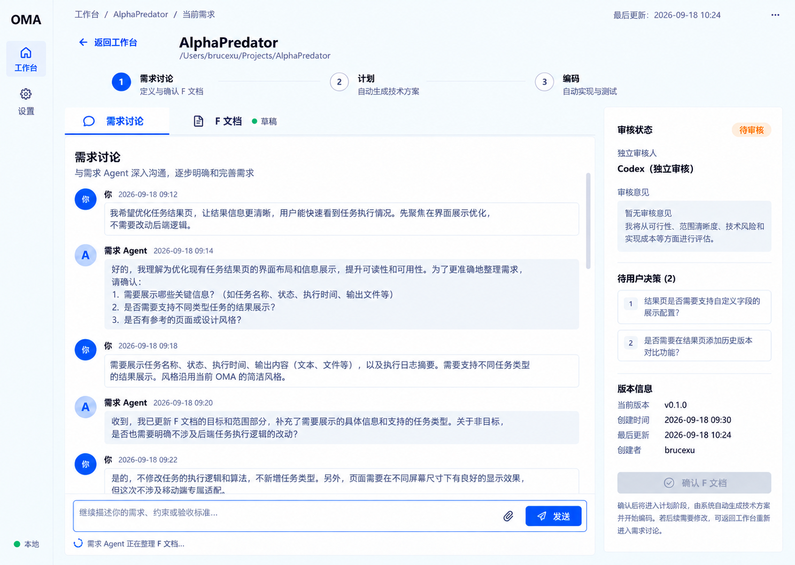

# F001 需求讨论界面

**STATUS**：界面与导航交互已实现并验证，独立审核待后续需求
**MileStone**：第一阶段

## What

### 目标

为已有软件项目提供专门的需求讨论界面，使用户能够与需求 Agent 进行多轮讨论，同时查看由讨论形成的需求文档草稿、独立审核状态和待用户决策项。

需求讨论界面只负责确认“要实现什么”。需求文档经独立审核并由用户确认后，流程才进入计划阶段。

### 入口与页面层级

1. 用户进入应用时默认看到“工作台”。
2. 工作台展示当前已配置的已有项目。
3. 用户在工作台选择一个项目。
4. 系统进入该项目的需求详情页。
5. 页面顶部展示返回工作台入口、项目名称、项目路径和当前需求。
6. 页面展示“需求讨论 → 计划 → 编码”三阶段进度；本界面仅设计“需求讨论”阶段。

### 工作台视图

- 工作台是应用默认入口。
- 当前版本只展示 `/api/config` 返回的默认项目，不新增项目扫描、创建、删除或持久化管理能力。
- 项目卡片展示项目名称、本地路径和本地可用状态。
- 点击项目卡片进入该项目的需求讨论界面。
- 从需求讨论界面的侧栏“工作台”、顶部“返回工作台”或面包屑“工作台”均可返回工作台。

### 设置视图

- 侧栏“设置”可以进入真实的只读设置视图。
- 设置视图展示本地运行状态、默认项目路径和需求讨论的只读沙盒策略。
- 当前版本不提供可编辑的配置项，不展示不可用的保存按钮或伪配置控件。

### 页面导航

- 工作台、需求讨论和设置使用应用内路由切换，浏览器前进、后退可正常工作。
- 从需求讨论切换到工作台或设置后，当前会话、需求文档、未发送输入和滚动位置保留在本次页面会话中。

### 页面结构

#### 固定侧边栏

- 左侧为固定宽度的紧凑侧边栏。
- 侧边栏只包含 `OMA`、`工作台`、`设置`和本地运行状态。
- 侧边栏不提供展开、收起或调整宽度的按钮。
- 项目、需求和文档列表不放在侧边栏中。

#### 项目上下文

- 主内容区顶部展示面包屑：`工作台 / 当前项目 / 当前需求`。
- 提供“返回工作台”入口。
- 展示当前项目名称和本地项目路径。
- 展示三个阶段，并明确标识当前处于“需求讨论”。

#### 主工作区页签

主工作区使用两个页签：

1. `需求讨论`
2. `需求文档`

进入页面时默认打开“需求讨论”。两个页签复用同一主工作区，不同时并排展示。切换页签时，右侧审核栏保持可见，讨论记录、输入草稿和滚动位置不得丢失。

### 需求讨论页签

- 展示用户与需求 Agent 的多轮对话记录。
- 每条消息明确展示角色、时间和正文。
- 对话记录区域可以独立滚动。
- 页面底部固定显示多行输入框和“发送”按钮。
- 输入框提示文字为：`继续描述你的需求、约束或验收标准…`。
- Agent 正在根据讨论更新文档时，展示“需求 Agent 正在整理需求文档”的状态。
- 本需求不定义附件上传能力；实现时不提供仅作为装饰但不可使用的附件按钮。

### 需求文档页签

- 展示由当前讨论形成的需求文档草稿。
- 页签上展示草稿状态，并在文档更新时提供可见反馈。
- 需求文档至少呈现目标、范围、非目标、主要行为和验收标准。
- 需求文档在本界面中只读；用户通过继续讨论要求修订，不直接编辑文档正文。
- 视觉稿中的示例需求和示例数据仅用于表达布局，不属于本需求事实。

### 右侧审核栏

右侧审核栏在两个页签之间保持不变，展示：

- 当前审核状态。
- 独立审核角色及审核意见。
- 待用户决策项。
- 需求文档版本和更新时间。
- “确认需求文档”操作。

存在未解决的用户决策、独立审核尚未通过或需求文档仍在更新时，“确认需求文档”不可用。审核通过且不存在待决策项后，用户可以确认需求文档；确认后进入计划阶段。

审核退回时，界面继续停留在需求讨论阶段，展示具体审核意见，并允许用户与需求 Agent 继续讨论和修订需求文档。

### 视觉基线

视觉基线用于约束页面层级、布局和整体视觉语言。图片中的示例文案、项目名称、时间和版本号不构成业务需求。

### 非目标

- 不实现工作台中的项目扫描、创建、删除或持久化管理。
- 不提供可编辑的设置项。
- 不设计计划阶段和编码阶段的具体页面。
- 不实现三阶段工作流引擎、审核 Agent 或状态持久化。
- 不定义附件上传能力。
- 不定义移动端界面。
- 不新增模型选择、模型路由、通用 Agent 市场或动态 Agent 数量等能力。

## How

### 实现边界

- 沿用当前 TypeScript HTTP 服务和原生 HTML、CSS、JavaScript，不引入前端框架、组件库或新的持久化层。
- 需求讨论使用 Codex SDK 的同一 `thread_id` 续接后续消息，实现真实多轮对话；页面刷新后会话丢失，符合本需求“不实现状态持久化”的边界。
- 需求讨论固定使用只读沙盒，避免“讨论需求”时修改目标项目。
- 需求 Agent 每轮返回结构化结果：讨论回复、需求文档草稿和待用户决策项。需求文档由同一讨论持续更新，不额外引入工作流引擎。
- 本需求不实现独立审核 Agent。审核栏如实显示“等待独立审核”，因此当前版本的“确认需求文档”保持禁用；不使用假审核结果伪造可确认状态。后续审核能力接入后再实现“审核通过并进入计划阶段”的真实业务闭环。

### 前端改造

1. 重写 `src/static/index.html`，按视觉基线建立固定侧边栏、项目上下文、三阶段进度、双页签主工作区和常驻审核栏。
2. 重写 `src/static/styles.css`，实现桌面端自适应布局、独立滚动的对话区、固定输入区、页签状态、消息层级、只读需求文档和审核状态样式。
3. 重写 `src/static/app.js`，维护当前页签、消息列表、输入草稿、讨论滚动位置、`thread_id`、需求文档草稿、待决策项和请求状态。
4. 发送消息时立即追加用户消息并进入“需求 Agent 正在整理需求文档”状态；请求成功后追加 Agent 回复并更新需求文档，失败时保留输入上下文并在对话区显示可重试错误。
5. 页签切换只改变主工作区内容，不重建会话状态；切回讨论页时恢复原输入草稿和滚动位置。
6. 侧边栏中的“工作台”和“设置”使用真实按钮切换对应视图，不放置无效的展开、附件、模型选择或 Agent 市场控件。
7. 增加工作台和只读设置视图；侧栏、项目卡片、返回入口与面包屑使用同一应用内路由切换，并支持浏览器前进、后退。
8. 三个视图保留在同一页面会话中，只切换可见状态，避免离开需求页时丢失讨论记录、需求文档、输入草稿和滚动位置。

### 服务端改造

1. 新增需求讨论接口，接收项目路径、用户消息和可选 `thread_id`。
2. 首轮调用 `startThread`，后续调用 `resumeThread`；接口返回当前 `thread_id`、Agent 回复、需求文档草稿和待决策项。
3. 使用 Codex SDK 的 `outputSchema` 约束需求 Agent 输出，并在服务端校验结构化结果；无效输出返回明确错误，不把无法解析的内容伪装成需求文档。
4. 保留现有通用 `/api/runs` 行为，避免本次 UI 改造破坏已有调用边界。
5. 项目名称由默认项目路径的目录名生成，项目路径继续由 `/api/config` 提供；本需求不新增工作台项目选择接口。

### 验证计划

1. 服务端测试：验证首次讨论、携带 `thread_id` 的续接讨论、空消息、非法结构化输出和项目路径错误。
2. 前端交互验证：验证消息发送、忙碌与错误状态、双页签切换、输入草稿保留、滚动位置恢复、需求文档更新和审核栏常驻。
3. 回归验证：运行 `npm test` 和 `npm run build`，确认原有 `/api/runs` 与静态资源服务未被破坏。
4. 视觉验证：启动本地应用，在 Codex 内置浏览器中按视觉基线检查布局、主要交互、窄窗口表现和可访问性；完成 Product Design QA，并修复全部 P0、P1、P2 问题后再交付。

## MCP

本需求不新增 MCP Tool。

## Acceptance Criteria

1. 用户进入应用时默认打开工作台，并能看到当前默认项目的名称、路径和本地状态。
2. 用户点击项目卡片后进入需求详情页；需求详情页默认打开“需求讨论”页签，并展示三阶段进度和当前项目上下文。
3. 用户可以通过侧栏“工作台”、顶部“返回工作台”或面包屑“工作台”返回工作台。
4. 用户点击侧栏“设置”后进入只读设置视图，并能看到本地状态、默认项目路径和只读沙盒策略。
5. 浏览器前进、后退可以在工作台、需求讨论和设置之间切换。
6. 左侧为固定紧凑侧边栏，且不存在展开、收起或调整宽度的控件。
7. 用户可以查看多轮讨论记录，并能通过固定在底部的输入框发送新消息。
8. 用户切换到“需求文档”页签后，可以查看由讨论形成的当前草稿。
9. “需求讨论”和“需求文档”不会同时挤在主工作区内展示。
10. 页面或页签切换不会丢失讨论记录、未发送的输入内容或原有滚动位置。
11. 右侧审核栏在两个页签中始终可见，并展示审核状态、审核意见、待用户决策和版本信息。
12. 独立审核未通过、仍有待用户决策或文档正在更新时，用户不能确认需求文档。
13. 独立审核通过且不存在待用户决策后，用户可以确认需求文档并进入计划阶段。
14. 页面不展示未实现的附件按钮、模型选择、Agent 市场、可编辑设置或其他未经确认的能力。
